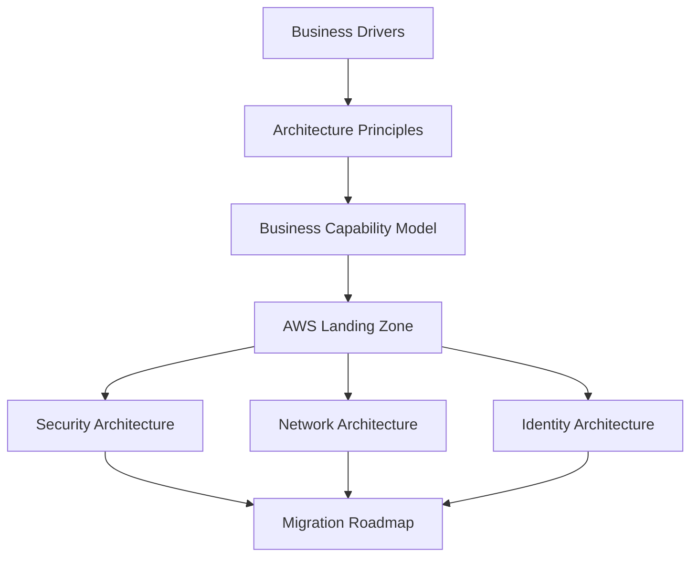

# AWS Landing Zone using TOGAF

## Enterprise Architecture Reference Implementation

Designing a secure, scalable, and governed AWS Landing Zone using TOGAF principles and AWS best practices.

This architecture series demonstrates how Enterprise Architecture can be used to transform business strategy into a secure and operational AWS cloud platform suitable for large enterprises and financial institutions.

---

## Architecture Journey

---

# Overview

The architecture covers:

* Business Drivers
* Enterprise Architecture Principles
* Business Capability Mapping
* AWS Organization Design
* Landing Zone Design
* Security Architecture
* Network Architecture
* Identity Architecture
* Platform Engineering
* Governance
* Migration Strategy

---

# Architecture Series

## Phase 1 – Enterprise Foundation

### 📘 Part 1 – Executive Summary

[Read Part 1](./01-executive-summary.md)

### 🎯 Part 2 – Business Drivers

[Read Part 2](./02-business-drivers.md)

### 📐 Part 3 – Enterprise Architecture Principles

[Read Part 3](./03-enterprise-architecture-principles.md)

### 🏢 Part 4 – Business Capability Model

[Read Part 4](./04-business-capability-model.md)

---

## Phase 2 – AWS Landing Zone Design

### ☁️ Part 5 – Target AWS Organization Structure

[Read Part 5](./05-target-aws-organization-structure.md)

### 🏗️ Part 6 – Landing Zone Design Principles

[Read Part 6](./06-landing-zone-design-principles.md)

### 📄 Part 7 – Architecture Decision Records

[Read Part 7](./07-architecture-decision-records.md)

### ⚖️ Part 8 – Governance Model

[Read Part 8](./08-governance-model.md)

---

## Phase 3 – TOGAF Architecture Mapping

### 🔄 Part 9 – TOGAF ADM Mapping to AWS Landing Zone

[Read Part 9](./09-togaf-adm-mapping.md)

---

## Phase 4 – Target Architecture

### 🏛️ Part 10 – AWS Landing Zone Target Architecture

[Read Part 10](./10-aws-landing-zone-target-architecture.md)

### 🔐 Part 11 – Security Architecture

[Read Part 11](./11-security-architecture.md)

### 🌐 Part 12 – Network Architecture

[Read Part 12](./12-network-architecture.md)

### 👤 Part 13 – Identity Architecture

[Read Part 13](./13-identity-architecture.md)

### 🚀 Part 14 – Platform Engineering

[Read Part 14](./14-platform-engineering.md)

---

## Phase 5 – Transformation

### 🛣️ Part 15 – Migration Roadmap

[Read Part 15](./15-migration-roadmap.md)

### 🎉 Part 16 – Conclusion

[Read Part 16](./16-conclusion.md)

---

# Series Status

| Section                   | Status         |
| ------------------------- | -------------- |
| Executive Summary         | ✅ Published    |
| Business Drivers          | ✅ Published    |
| Architecture Principles   | 🚧 In Progress |
| Business Capability Model | ⏳ Planned      |
| AWS Organization Design   | ⏳ Planned      |
| Landing Zone Design       | ⏳ Planned      |
| Governance                | ⏳ Planned      |
| Security Architecture     | ⏳ Planned      |
| Network Architecture      | ⏳ Planned      |
| Identity Architecture     | ⏳ Planned      |
| Platform Engineering      | ⏳ Planned      |
| Migration Roadmap         | ⏳ Planned      |

---

# Technologies Covered

## AWS Services

* AWS Organizations
* AWS Control Tower
* IAM Identity Center
* AWS Config
* CloudTrail
* Security Hub
* GuardDuty
* Transit Gateway
* AWS Organizations SCP
* EKS
* Route53
* Direct Connect

## Engineering Practices

* Infrastructure as Code
* Terraform
* GitOps
* Platform Engineering
* DevSecOps
* Enterprise Governance

## Architecture Frameworks

* TOGAF
* Architecture Decision Records (ADR)
* Well-Architected Framework
* Cloud Adoption Framework

---

# Target Audience

This series is intended for:

* Enterprise Architects
* Cloud Architects
* Solution Architects
* Platform Engineers
* Engineering Managers
* Technology Leaders
* AWS Practitioners

---
